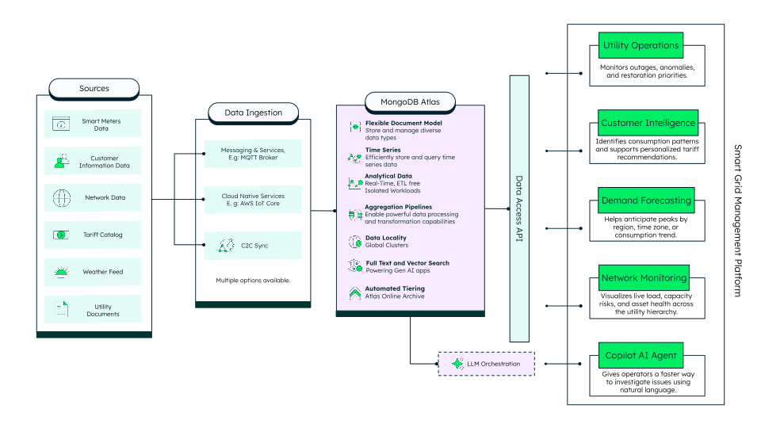
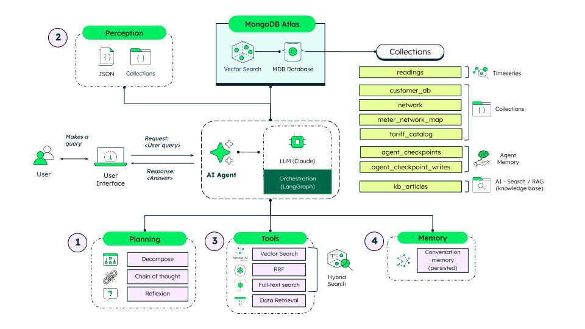

# Smart Grid Intelligent Platform

This demo showcases how a utility can turn raw smart-meter data into real-time
operational decisions using MongoDB Atlas. Built on a single operational data
layer, it helps grid operators detect outages faster, monitor the health of the
grid network, understand customer consumption, forecast demand peaks, and
investigate issues in natural language.

It brings five workloads together over the same smart-meter data:

- **Monitoring** - outages, grid/feeder stability, anomalies, power factor, live readings, and a customer/outage map.
- **Network Center** - the grid topology (utility → substation → feeder → transformer), substation health, capacity pressure, and outage status.
- **Customers** - profile, latest reading, tariff recommendation, insights, appliance breakdown, usage segment, and consumption trend.
- **Forecasting** - expected demand and peak timing per region, weather-adjusted with external data, plus the exact aggregation pipeline behind it.
- **Grid Support Agent
** - a LangGraph multi-agent chatbot that answers questions over the data and a knowledge base using hybrid search.

Every card exposes a `{ }` **"Show document"** button that reveals the real
documents and aggregation pipelines powering it.

## Where MongoDB Shines?

- **Atlas Time Series** - high-frequency smart-meter readings stored and queried efficiently.
- **Aggregation Framework** - analytics run in the database: `$setWindowFields`/`$shift` (gaps-and-islands outage detection), `$lookup` across the grid topology for utilization, and `$group` with `$stdDevSamp` for anomalies and forecasting.
- **Flexible document model** - meters, customers, and the grid hierarchy live as related documents joined on demand; the schema evolves without migrations.
- **Atlas Vector Search with automated Voyage AI embeddings** - semantic search with no separate embedding service.
- **Hybrid search** - vector + full-text results fused with Reciprocal Rank Fusion (RRF).
- **Agentic AI on MongoDB** - a LangGraph multi-agent with conversation memory persisted in Atlas (`agent_checkpoints`).

## High Level Architecture

The platform combines two architectures on a single Atlas cluster: an
**operational data layer** (monitoring, network, forecasting, customers) and an
**agentic AI layer** that lets users query it all in natural language.

### Operational data layer


### Agentic AI layer


## Tech Stack

- Next.js [App Router](https://nextjs.org/docs/app) for the framework and API routes
- [MongoDB Atlas](https://www.mongodb.com/atlas/database) for the database, search, and agent memory
- [LangGraph.js](https://langchain-ai.github.io/langgraphjs/) for the multi-agent orchestration
- [Anthropic Claude](https://www.anthropic.com/) as the LLM and [Voyage AI](https://www.voyageai.com/) for embeddings
- [Recharts](https://recharts.org/) and [LeafyGreen UI](https://www.mongodb.design/) for the interface

## Prerequisites

Before you begin, ensure you have the following:

- **Node.js 22** or higher
- A **MongoDB Atlas** account with a cluster (**M10 or higher** - required for Atlas Vector Search with automated embeddings)
- The **[MongoDB Database Tools](https://www.mongodb.com/docs/database-tools/)** (`mongorestore`) - on macOS: `brew install mongodb/brew/mongodb-database-tools`
- An **Anthropic API key** (the AI assistant uses Claude)
- A **Voyage AI API key** (used by the Vector Map visualization)

<!-- > Optional: the repository includes a FastAPI backend scaffold (Python 3.13 + [uv](https://docs.astral.sh/uv/)). The demo runs entirely on the Next.js frontend and Atlas, so the backend is **not required**. -->

## Run it Locally

### 1. Clone the repository

```bash
git clone https://github.com/mongodb-industry-solutions/smart-grid-platform.git
cd smart-meter
```

### 2. Install frontend dependencies

```bash
cd frontend
npm install
```

### 3. Configure environment variables

Create a `.env.local` file inside the `frontend` folder:

```bash
MONGODB_URI=<YOUR_MONGODB_ATLAS_CONNECTION_STRING>
DATABASE_NAME=<YOUR_DATABASE_NAME>

# AI assistant - Claude via the standard Anthropic API
ANTHROPIC_API_KEY=<YOUR_ANTHROPIC_API_KEY>
# Optional: override the default model (claude-haiku-4-5)
# ANTHROPIC_MODEL=claude-haiku-4-5

# Vector Map visualization - direct Voyage AI embeddings
VOYAGE_API_KEY=<YOUR_VOYAGE_API_KEY>
```

> **MongoDB internal users** can instead point the assistant at the Grove gateway
> by setting `GROVE_API_KEY` (and optionally `GROVE_ANTHROPIC_URL`). When those are
> absent, the app uses the standard Anthropic API above.

If you need help getting your Atlas connection string, see
[Connect to your cluster](https://www.mongodb.com/docs/atlas/tutorial/connect-to-your-cluster/).

### 4. Load the data

The demo runs on five operational collections (`readings`, `network`,
`meter_network_map`, `customer_db`, `tariff_catalog`) plus the AI knowledge base
(`kb_articles`).

**a. Restore the operational collections** from the committed `dump/` directory
into your own cluster (the script reads `MONGODB_URI` / `DATABASE_NAME` from
`frontend/.env.local`). From the **repo root**:

```bash
./scripts/restore-data.sh
# or: make restore_data
```

**b. Seed the AI knowledge base.** This loads the articles and creates the Atlas
Vector Search (automated Voyage AI embeddings) and full-text search indexes used
for hybrid retrieval. From the `frontend` folder:

```bash
node --env-file=.env.local scripts/seedKnowledgeBase.mjs
```

> Atlas builds search indexes asynchronously - allow about a minute before
> querying the assistant.

### 5. Start the frontend

From the `frontend` folder:

```bash
npm run dev
```

The application is now available at **http://localhost:3000**. Explore the
Monitoring, Network Center, Customers, Forecasting, and Grid Support Agent views.

<!-- ### (Optional) Run the backend

The FastAPI scaffold is not required for the demo. If you want to run it:

```bash
# from the repo root
make uv_init
make uv_sync
cd backend
uv run uvicorn main:app --host 0.0.0.0 --port 8000
```

The backend API will be accessible at http://localhost:8000. Create a `.env` file
in `backend/` with `MONGODB_URI`, `DATABASE_NAME`, and `APP_NAME` if you use it. -->

## Environment variables

| Variable | Where | Required | Description |
| --- | --- | --- | --- |
| `MONGODB_URI` | `frontend/.env.local` | Yes | Atlas connection string. |
| `DATABASE_NAME` | `frontend/.env.local` | Yes | Target database name. |
| `ANTHROPIC_API_KEY` | `frontend/.env.local` | Yes* | Claude API key for the AI assistant. |
| `VOYAGE_API_KEY` | `frontend/.env.local` | Yes | Voyage AI key for the Vector Map. |
| `ANTHROPIC_MODEL` | `frontend/.env.local` | No | Override the default model (`claude-haiku-4-5`). |
| `GROVE_API_KEY` / `GROVE_ANTHROPIC_URL` | `frontend/.env.local` | No | MongoDB-internal Grove gateway (used instead of `ANTHROPIC_API_KEY` when set). |

\* Either `ANTHROPIC_API_KEY` or `GROVE_API_KEY` must be set.

## Load / refresh the data (maintainers)

To refresh the committed `dump/` from a source cluster, run from the repo root:

```bash
./scripts/dump-data.sh
# or: make dump_data
```

Then commit the updated `dump/` directory. The knowledge base is not dumped - it
is (re)created by `frontend/scripts/seedKnowledgeBase.mjs`, which also builds the
search indexes.

<!-- ## Run with Docker

From the repo root:

```bash
# build and start
make build

# stop and remove containers/images
make clean
``` -->

## Common errors

### Frontend

- **`Set ANTHROPIC_API_KEY ...`** - the AI assistant has no LLM credentials. Set `ANTHROPIC_API_KEY` (or `GROVE_API_KEY`) in `frontend/.env.local` and restart `npm run dev`.
- **Empty dashboards** - the data hasn't been loaded. Run `./scripts/restore-data.sh` and the knowledge-base seed.
- **AI assistant returns no sources** - the Atlas search indexes are still building, or the cluster tier is below M10 (required for Vector Search with automated embeddings).

### Data tools

- **`mongorestore: command not found`** - install the MongoDB Database Tools (`brew install mongodb/brew/mongodb-database-tools`).
